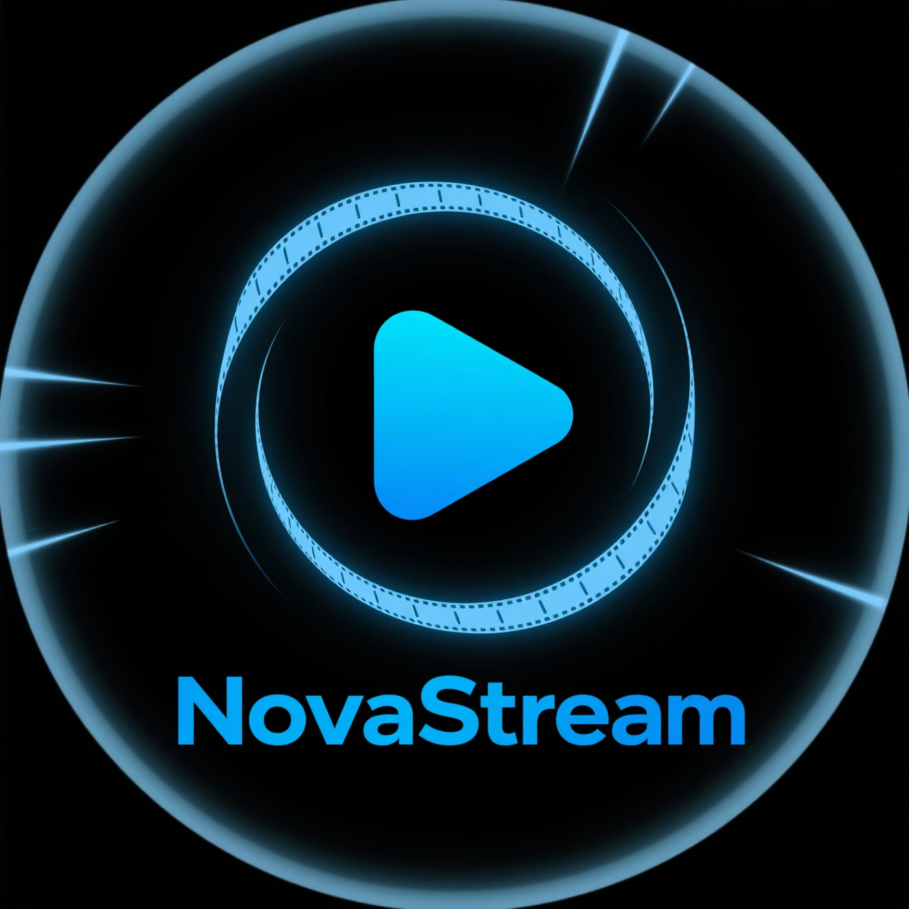

# NovaStream

<div align="center">
  
</div>

🚀 一个基于 Nuxt 和 Golang 构建的极速、轻量且开源的流媒体平台。

NovaStream 是一个高性能的自托管流媒体平台，灵感源自 [LibreTV](https://github.com/LibreSpark/LibreTV) 和 [MoonTV](https://github.com/senshinya/MoonTV)，采用 Nuxt 4 和 Golang 重新编写，拥有更优性能、更强模块化和更便捷定制性。

---

## ✨ 项目特性

- ⚡ **高性能**：后端采用 Go，前端基于 Nuxt 4，响应迅速。
- 🌈 **轻量美观**：界面现代，响应式设计，基于 Vue 3 + TailwindCSS。
- 🔓 **完全开源**：MIT 许可，易于二次开发和扩展。
- 🧩 **模块化设计**：后端与前端均支持插件式扩展。
- 📺 **多媒体流支持**：支持电影、剧集、IPTV、种子（可选）。

---

## 📦 技术栈

| 层级       | 技术选型                      |
|------------|-------------------------------|
| 前端       | Nuxt 4, Vue 3, TailwindCSS    |
| 后端       | Golang (Gin/GORM 等)          |
| API        | REST / JSON                   |
| 部署       | Docker / K8s                  |

---

## 🗂️ 目录结构说明

```
NovaStream/
├── backend/         后端 Golang 服务
│   ├── cmd/         主程序入口（如 moonvue）
│   ├── config/      配置文件与加载逻辑
│   ├── db/          数据库 schema 文件
│   └── internal/    业务逻辑与数据访问
│       ├── dao/     数据访问对象
│       ├── database/数据库连接与操作
│       ├── logs/    日志相关
│       └── router/  路由定义
├── frontend/        前端 Nuxt 4 应用
│   ├── app/         应用主入口
│   ├── public/      静态资源（logo、favicon等）
│   └── ...          其他前端相关文件
├── Makefile         构建与管理脚本
└── README.md        项目说明文档
```

---

## ⚙️ 环境要求

- Node.js 18+，pnpm 包管理器（前端）
- Golang 1.20+（后端）
- 数据库推荐 MySQL 或 PostgreSQL

---

## 🚀 快速开始

### 1. 克隆项目

```bash
git clone https://github.com/zhutianlong1/NovaStream.git
cd NovaStream
```

### 2. 配置后端

1. 进入 `backend/config/` 目录，复制 `config.example.yaml` 为 `config.yaml`，并根据实际需求修改配置项。
2. 初始化数据库（可参考 `backend/db/schema.sql`）。
3. 启动后端服务：

```bash
make run
```

### 3. 配置前端

1. 进入 `frontend/` 目录。
2. 安装依赖：

```bash
pnpm install
```

3. 启动开发服务器：

```bash
pnpm dev
# 或在项目根目录执行 make dev
```

4. 打开浏览器访问 [http://localhost:3000](http://localhost:3000)

---

## 📚 参考与致谢

- 参考项目：[LibreTV](https://github.com/LibreSpark/LibreTV) 、[MoonTV](https://github.com/senshinya/MoonTV)
- Nuxt 4 官方文档：[https://nuxt.com/](https://nuxt.com/)
- Go 官方文档：[https://go.dev/](https://go.dev/)

---

## 🤝 贡献方式

欢迎通过 Issue 或 PR 参与项目共建，提出建议或提交代码。
